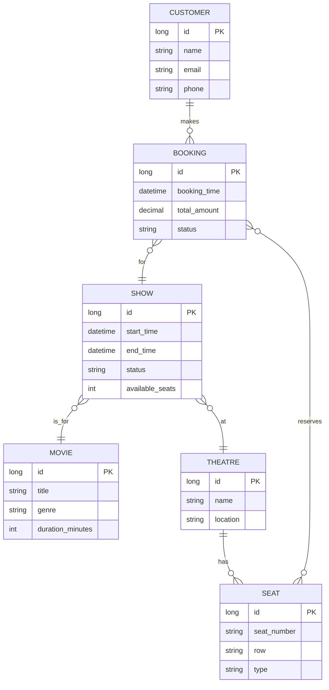

# 🎬 **DIGITAL MOVIE TICKET PORTAL**

---

A beginner-friendly yet professional **Java Full-Stack Project** designed using **Spring Boot** and **AngularJS**, the *Digital Movie Ticket Portal* enables users to seamlessly browse movies, check seat availability, and book tickets online. This system delivers a smooth ticket-booking experience with real-time validations, a responsive UI, and pre-configured sample data for instant execution.

---

## 📘 **Overview**

The **Digital Movie Ticket Portal** is a lightweight, interactive movie ticket booking application where users can book movie tickets based on their preferred theatre, showtime, and seat layout. It is ideal for beginners starting their journey in Java full-stack development using modern frameworks and tools.

This project uses an **H2 in-memory database** for fast setup, and users can easily switch to MySQL or any relational database when needed.

---

## 🚀 **Key Features**

### 🎥 **Movie & Show Management**

* Displays all active movies available for booking.
* Auto-scheduled sample shows for the current day.
* Real-time status updates for shows:

  * *Completed* — Show end time passed.
  * *Running* — Show is ongoing and cannot be booked.
  * *Upcoming* — Tickets open for booking.

### 🎫 **Ticket Booking**

* Users can select seats based on availability.
* Validation ensures the user cannot book running or completed shows.
* Smooth, intuitive ticket booking workflow.

### 📊 **Data Handling**

* Pre-loaded sample data for movies, theatres, shows, and seat layouts.
* Uses H2 database for easy local execution.
* Fully customizable database through `application.properties`.

### 🎨 **Modern UI**

* Clean user interface built with:

  * AngularJS
  * HTML & CSS
  * Bootstrap
* Responsive and beginner-friendly UI design.

---

## 🛠️ **Tech Stack**

### **Backend**

* Spring Boot
* Java
* Spring MVC / REST
* Spring Data JPA
* H2 Database (default)

### **Frontend**

* AngularJS
* HTML
* CSS
* Bootstrap

### **Tools**

* Git
* Any preferred IDE (STS, IntelliJ, VS Code)

---

## 🗂️ **Project Architecture**

* **Controller Layer** — REST API endpoints
* **Service Layer** — Core business logic
* **Repository Layer** — Database operations
* **UI Layer** — Frontend views and components

---

## 🗄️ **Database Configuration**

### **Default: H2 Database**

```properties
spring.datasource.url=jdbc:h2:mem:movie_db
spring.datasource.driverClassName=org.h2.Driver
spring.jpa.database-platform=org.hibernate.dialect.H2Dialect
spring.h2.console.enabled=true
```

### **Switching to MySQL**

```properties
spring.datasource.url=jdbc:mysql://localhost:3306/movie_db
spring.datasource.username=your_username
spring.datasource.password=your_password
```

---

## 🗺️ ER Diagram

Below is the Entity-Relationship diagram for the core data model of the **Digital Movie Ticket Portal**. The diagram shows main entities and their relationships: `Customer`, `Booking`, `Show`, `Movie`, `Theatre`, `Seat` and how they connect.

> **Mermaid (recommended for GitHub rendering)**



> **ASCII fallback (for environments where Mermaid is not rendered)**

```
+-----------+       +----------+       +-------+
|  CUSTOMER |1 -----*| BOOKING  |* -----1| SHOW  |
+-----------+       +----------+       +-------+
      |                                  |  |
      |                                  |  |
      |                                  |  +-------1 MOVIE
      |                                  |          +-------+
      |                                  |          | MOVIE |
      |                                  |          +-------+
      |                                  |
      |                                  |
      |                                  *
      |                                 / \
      |                                /   \
      |                               /     \
      |                              *       *
+-----------+                  +---------+ +-----+
|  THEATRE  |1 -------------*  |  SEAT   | | ... |
+-----------+                  +---------+ +-----+
```

**Notes on model choices:**

* `Seat` is linked to a `Theatre` (seat layout belongs to theatre). Availability for a particular show is tracked by show-level availability and individual `Booking` entries that reserve specific seats. Optionally, a `ShowSeat` join entity can be introduced to store seat status per show (e.g., reserved, available, blocked).
* `Booking` is the transactional entity that links `Customer`, `Show`, and one or more `Seat` records.

---

## 📦 **Sample Data Details**

The system loads sample data automatically for immediate testing:

* 4 pre-activated movies
* 4 theatres
* 4 shows for each theatre (current-day scheduling)
* Automatic show status updates based on current time
* Booking restrictions:

  * No booking for *running* or *completed* shows

This creates a realistic and efficient testing environment.

---

## ▶️ **How to Run the Application**

### **1️⃣ Clone the Repository**

```bash
git clone https://github.com/your-repo-url
cd digital-movie-ticket-portal
```

### **2️⃣ Backend Setup**

* Make sure **Java 17+** and **Spring Boot** are installed.
* Open the project in your IDE.
* Run using:

  * IDE → Run As → Spring Boot App
  * OR:

    ```bash
    mvn spring-boot:run
    ```

### **3️⃣ Frontend Setup**

* Open the frontend folder.
* Launch using a local server or environment compatible with AngularJS.

---

## 📚 **Ideal For**

* Java full-stack beginners
* Academic and mini-projects
* Students learning Spring Boot + AngularJS
* REST API and UI validation practice

---

## 🤝 **Contributing**

Contributions, improvements, and feature requests are welcome.

---

## 📝 **License**

This project is licensed under the MIT License.

---

